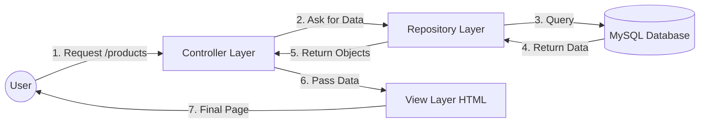

# LuxeStyle Project - MVC Architecture Explained

This document explains the **Model-View-Controller (MVC)** architecture used in your LuxeStyle Spring Boot project. This is a standard design pattern for web applications.

## 1. High-Level Diagram

How data flows when a user uses your website:

---

## 2. The Three Layers (M-V-C)

### 🧱 M - Model (The Data)
The **Model** represents the data in your application. It matches the tables in your database.
*   **Role**: Stores information (like Name, Price, Image).
*   **Where in Code**: `src/main/java/.../model/`
*   **Examples in Your Project**:
    *   `Product.java`: Represents a shoe or cloth item.
    *   `User.java`: Represents a registered customer.
    *   `Cart.java`: Represents items in the shopping cart.

### 🎮 C - Controller (The Brain)
The **Controller** handles user requests. It acts like a traffic policeman.
*   **Role**: Receives the request, asks the Model/Repository for data, and sends it to the View.
*   **Where in Code**: `src/main/java/.../controller/`
*   **Examples in Your Project**:
    *   `PublicProductController.java`:
        *   User asks for `/products`.
        *   Controller calls `productRepository.findAll()`.
        *   Controller gives this list to `products.html`.
    *   `PaymentController.java`: Handles the payment flow.

### 🖼️ V - View (The Face)
The **View** is what the user actually sees on their screen (HTML pages).
*   **Role**: Takes the data from the Controller and displays it beautifully.
*   **Where in Code**: `src/main/resources/templates/`
*   **Technology**: **Thymeleaf** (HTML with special `th:` tags).
*   **Examples in Your Project**:
    *   `products.html`: Shows the list of shoes/clothes.
    *   `payment.html`: Shows the checkout form.
    *   `base.html`: Common header and footer.

---

## 3. Real-Life Example: "User Searches for 'Shoes'"

Here is step-by-step what happens in your code:

1.  **User Action**: Types "Shoes" in the search bar and hits Enter (Request goes to `/products?keyword=Shoes`).
2.  **Controller (`PublicProductController`)**:
    *   Receives `keyword="Shoes"`.
    *   Calls `productRepository.findByName...("Shoes")`.
3.  **Model/Repository**:
    *   Talks to Database: `SELECT * FROM Product WHERE name LIKE '%Shoes%'`.
    *   Returns a list of `Product` objects (Model).
4.  **Controller**:
    *   Puts this list into the `Model` object: `model.addAttribute("products", list)`.
    *   Tells Spring to render `products.html`.
5.  **View (`products.html`)**:
    *   Loops through the list using `th:each="product : ${products}"`.
    *   Generates the HTML card for each shoe.
6.  **Response**: The user sees the page with only shoes.

---

## 4. Why Use MVC?
*   **Separation of Concerns**: The design (HTML) is separate from Logic (Java). You can change the button color without breaking the payment code.
*   **Easy to Maintain**: If the database changes, you only fix the Model/Repository. The Controller acts as a buffer.
*   **Standard**: Every major company (Google, Amazon, etc.) uses some form of this pattern.
